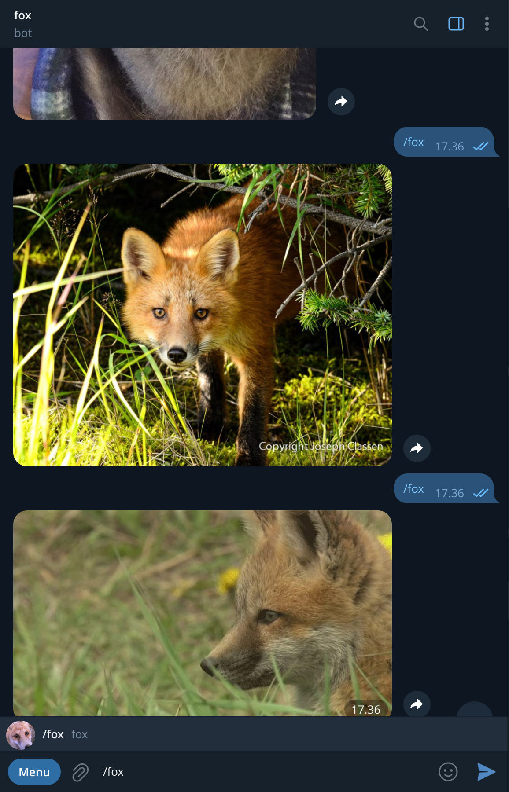

# foxbot

Telegram bot that sends a random fox image on `/fox` command.

Images sourced from [NotiLo-A/foxbot/foxes](https://github.com/NotiLo-A/foxbot/tree/main/foxes).



## Local

Requires Go 1.22+.

```bash
git clone https://github.com/yourname/foxbot
cd foxbot
BOT_TOKEN=your_token go run .
```

## Production

Build for Linux and copy to the server:

```bash
GOOS=linux GOARCH=amd64 go build -o foxbot .
scp foxbot user@your-server:/usr/local/bin/foxbot
```

Create and enable a systemd service:

```bash
sudo tee /etc/systemd/system/foxbot.service << 'EOF'
[Unit]
Description=Fox Telegram Bot
After=network.target

[Service]
ExecStart=/usr/local/bin/foxbot
Restart=on-failure
RestartSec=5
Environment=BOT_TOKEN=your_token

[Install]
WantedBy=multi-user.target
EOF

sudo systemctl daemon-reload
sudo systemctl enable --now foxbot
```
